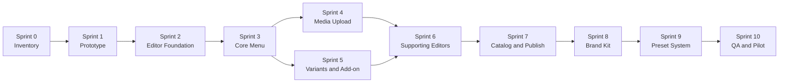

# SagaMenu Dashboard Wizard Sprint Plan

Tanggal: 26 Juli 2026

Status: implemented locally and released as a Vercel review prototype on 26 July 2026

Execution: 11 sprint dikompresi menjadi satu implementation wave dengan gate per lapisan

Prioritas: dashboard wizard terlebih dahulu, kemudian appearance dan public surface

## Sasaran Akhir

Owner dapat membuat, mengedit, dan mengelola menu tanpa memahami struktur database, tanpa memasukkan URL foto, dan tanpa takut perubahan langsung tampil ke customer.

Target pengalaman:

- create/edit menu memakai satu workflow yang sama;
- empat langkah utama yang mudah dipahami;
- foto dapat di-upload langsung;
- kategori dan add-on dapat dibuat tanpa meninggalkan editor;
- perubahan selalu aman sebagai draft;
- preview Bio Menu dan Store Display selalu tersedia;
- dashboard memakai Plus Jakarta Sans secara konsisten;
- branding customer hanya memengaruhi public menu dan preview;
- publish tetap menjadi tindakan terpisah.

## Prinsip Eksekusi

1. Prototype dan validasi flow sebelum implementation.
2. Satu reusable editor shell untuk seluruh workflow.
3. Complex task memakai full-page editor.
4. Simple task memakai side sheet atau dialog kecil.
5. Draft dan live selalu dibedakan secara visual.
6. Public Store/Bio tidak diubah sebelum dashboard wizard stabil.
7. Setiap sprint harus lulus functional, visual, responsive, dan accessibility gate.

## Wave A: UX Validation

### Sprint 0: Wizard Inventory and Baseline

Durasi: 2-3 hari

Tujuan:

- memetakan semua create/edit flow;
- mengunci information architecture;
- menentukan baseline task completion.

Scope:

- menu create/edit;
- category create/edit;
- add-on create/edit;
- catalog setup;
- media upload/library;
- custom font upload;
- appearance;
- publish;
- business profile.

Aktivitas:

- audit semua Filament form dan prototype dialog;
- tentukan field wajib, opsional, advanced, dan system-generated;
- petakan dependency antar-field;
- petakan empty, loading, error, offline, permission, dan session-expired state;
- ukur jumlah klik dan field pada flow sekarang;
- tentukan copy glossary Bahasa Indonesia.

Deliverable:

- wizard inventory;
- field priority matrix;
- state map;
- user-flow diagram;
- baseline QA scenario.

Acceptance gate:

- setiap flow mempunyai start, completion, cancel, recovery, dan error path;
- tidak ada field penting tanpa owner atau source of truth;
- istilah UI tidak memakai nama model internal.

### Sprint 1: High-Fidelity Menu Wizard Prototype

Durasi: 4-5 hari

Tujuan:

- memvalidasi create/edit menu sebelum coding Laravel.

Prototype screens:

1. Informasi Dasar
2. Foto dan Media
3. Pilihan dan Detail
4. Review
5. Draft saved
6. Upload failed
7. Unsaved change confirmation
8. Mobile dashboard editor

Interaction:

- stepper;
- sticky preview;
- Bio/Store toggle;
- inline category create;
- simulated upload progress;
- add-on attachment;
- save draft;
- return to list.

Test scenarios:

1. Membuat kopi sederhana dengan satu foto.
2. Membuat menu dengan variants dan add-on.
3. Mengedit item live lalu menyimpan perubahan sebagai draft.

Deliverable:

- interactive Vercel prototype;
- desktop 1440 px;
- tablet 1024 px;
- mobile dashboard 390 px;
- UX test notes dan revisions.

Acceptance gate:

- tiga task dapat diselesaikan tanpa penjelasan tambahan;
- user memahami draft tidak sama dengan publish;
- preview tidak mengganggu pengisian form;
- tidak ada URL foto pada normal flow;
- hierarchy mendapat persetujuan Andreas.

## Wave B: Core Dashboard Implementation

### Sprint 2: Typography and Editor Foundation

Durasi: 4-5 hari

Tujuan:

- membangun fondasi visual dan teknis reusable.

Scope:

- self-host Plus Jakarta Sans 400/500/600/700;
- migrasi dashboard, auth, navigation, form, toast, dan system state;
- reusable full-page editor shell;
- header, breadcrumb, status draft, stepper, preview rail, dan sticky footer;
- responsive editor layout;
- unsaved change guard;
- save state component.

Technical direction:

- create/edit menjadi Filament resource pages, bukan modal;
- owner biasa tidak melihat slug, organization ID, currency, atau sort order;
- editor shell dapat dipakai menu, catalog onboarding, dan appearance.

Deliverable:

- editor shell component;
- design tokens;
- Plus Jakarta Sans package;
- responsive layout tests;
- accessibility foundation.

Acceptance gate:

- dashboard dan auth hanya memakai Plus Jakarta Sans;
- create/edit route mempunyai authorization test;
- 390, 768, 1024, dan 1440 px tidak overflow;
- keyboard focus dan sticky footer bekerja;
- customer custom font tidak memengaruhi dashboard chrome.

### Sprint 3: Core Create and Edit Menu

Durasi: 5 hari

Tujuan:

- mengimplementasikan Step 1 dan Step 4.

Step 1:

- nama;
- kategori;
- price type;
- formatted price;
- description;
- availability.

Step 4:

- summary;
- completeness;
- warning/error;
- Bio/Store preview;
- save and exit;
- save and add another.

Draft behavior:

- draft dibuat setelah minimum information valid;
- subsequent changes autosave;
- status menyimpan/tersimpan/gagal;
- live snapshot tidak berubah;
- refresh recovery.

Deliverable:

- working create flow;
- working edit flow;
- direct links dari dashboard attention item;
- draft/live compare indicator.

Acceptance gate:

- menu sederhana selesai dalam kurang dari 3 menit;
- create dan edit memakai komponen yang sama;
- validation muncul inline;
- refresh tidak menghilangkan draft;
- tidak ada perubahan yang tampil live.

### Sprint 4: Inline Media Upload

Durasi: 5 hari

Tujuan:

- menghapus ketergantungan terhadap URL foto.

Scope:

- drag-and-drop upload;
- device file picker;
- choose from Media Library;
- progress, processing, retry, replace, remove;
- primary image dan gallery;
- alt text;
- focal point;
- Store/Bio crop preview;
- orphan upload cleanup.

Backend:

- organization-scoped path;
- JPG, PNG, dan WebP;
- maksimum 5 MB;
- MIME, extension, signature, size, dan malware validation;
- image width/height metadata;
- thumbnail and responsive derivative;
- object-storage adapter;
- audit log.

Compatibility:

- legacy URL tetap dapat dirender;
- user tidak dapat membuat URL media baru dari dashboard;
- migration ke stored asset dilakukan terpisah.

Deliverable:

- inline uploader;
- media picker;
- processing queue;
- secure upload tests;
- recovery states.

Acceptance gate:

- upload, retry, replace, dan remove lulus E2E;
- cross-tenant media access ditolak;
- invalid and oversized file fail closed;
- upload tetap aman saat user berpindah step;
- photo layout mendeteksi missing image sebelum publish.

## Wave C: Complete Dashboard Workflows

### Sprint 5: Variants, Add-on, and Menu Detail

Durasi: 5 hari

Tujuan:

- mengimplementasikan Step 3 secara mudah dipahami.

Scope:

- variant groups;
- variant values;
- option/add-on group attachment;
- inline add-on create;
- single/multiple rule;
- maximum choice;
- price delta;
- allergens, dietary, ingredients, caffeine, spice, dan serving note;
- badges;
- sortable rows;
- keyboard move up/down.

Progressive disclosure:

- variants dan add-on tampil sebagai primary advanced option;
- food facts berada dalam collapsible detail;
- field kosong tidak memenuhi layar.

Deliverable:

- complete Step 3;
- detail preview parity;
- reusable option rows;
- inline add-on side sheet.

Acceptance gate:

- add-on dapat dibuat tanpa meninggalkan menu;
- values dapat ditambah, duplicate, edit, remove, dan reorder;
- preview menggunakan renderer publik yang sama;
- menu tanpa variants tidak terbebani field kosong.

### Sprint 6: Category, Add-on, and Media Library Editors

Durasi: 5 hari

Tujuan:

- menyeragamkan supporting CRUD.

Category side sheet:

- name;
- description;
- visibility;
- order;
- usage count;
- move-items-before-delete.

Add-on builder:

- group identity;
- choice rule;
- values;
- usage list;
- safe delete.

Media Library:

- visual grid;
- thumbnail;
- type and dimension;
- usage count;
- alt-text status;
- filter and search;
- safe remove;
- bulk selection untuk unused asset.

Deliverable:

- three supporting editors;
- empty/loading/error states;
- delete protection;
- shared interaction patterns.

Acceptance gate:

- user tidak perlu membuka generic database-style form;
- in-use category/add-on/media tidak dapat terhapus diam-diam;
- every destructive action mempunyai impact summary;
- all editors accessible pada 390 px.

### Sprint 7: Catalog Setup and Publish Workflow

Durasi: 4-5 hari

Tujuan:

- menyelesaikan lifecycle dashboard dari setup sampai publish.

Catalog first-time wizard:

1. Business information
2. Active surfaces
3. Basic brand
4. Starter content and review

Publish flow:

1. Quality check
2. Draft/live comparison
3. Surface confirmation
4. Publish processing
5. Success or safe failure

Deliverable:

- first catalog onboarding;
- refined pre-publish checklist;
- publish status and retry;
- maintenance state explanation;
- dashboard attention deep links.

Acceptance gate:

- publish gagal mempertahankan snapshot live;
- owner mengetahui surface yang akan berubah;
- catalog restricted tetap menampilkan maintenance;
- retry idempotent;
- onboarding tidak muncul lagi setelah selesai.

## Wave D: Appearance and Presets

### Sprint 8: Brand Kit and Appearance Editor

Durasi: 5 hari

Dependency:

- Sprint 2-7 harus lulus.

Tujuan:

- membangun appearance editor setelah wizard dashboard stabil.

Brand Kit:

- logo;
- primary, accent, paper, dan ink color;
- heading font;
- body font;
- font weight;
- text scale;
- radius;
- image treatment.

Custom font:

- grouped font family;
- WOFF2/WOFF;
- weight variants;
- license confirmation;
- load preview;
- invalid-font fallback;
- remove/replace.

Appearance workspace:

- controls left;
- large preview right;
- one active device;
- Bio/Store switch;
- contrast warning;
- reset to preset;
- save draft.

Acceptance gate:

- public default menggunakan Plus Jakarta Sans;
- custom font hanya memengaruhi public preview;
- invalid font kembali ke safe fallback;
- contrast validation tersedia;
- Brand Kit tersimpan tanpa publish otomatis.

### Sprint 9: Store and Bio Preset System

Durasi: 5 hari

Tujuan:

- memperluas variasi visual tanpa memecah konsistensi brand.

Architecture:

- global Brand Kit;
- independent Bio layout preset;
- independent Store layout preset;
- shared token schema;
- versioned preset definition;
- migration and fallback.

Preset package:

- accurate thumbnail;
- color tokens;
- font pairing;
- card style;
- category navigation;
- density;
- image treatment;
- Store preview;
- Bio preview.

Deliverable:

- preset registry;
- preset thumbnails;
- reset and compare;
- preset migration test;
- initial curated preset set.

Acceptance gate:

- Bio dan Store boleh berbeda layout tetapi tetap satu brand;
- existing catalog tidak rusak;
- preset apply dapat dibatalkan sebelum save;
- custom adjustments tidak hilang tanpa confirmation.

## Wave E: Release Quality

### Sprint 10: End-to-End QA and Pilot Gate

Durasi: 5 hari

Functional test:

- create/edit basic menu;
- create/edit complex menu;
- image upload failure/retry;
- category and add-on inline create;
- draft recovery;
- edit live item without publishing;
- publish success/failure;
- custom font upload;
- preset apply/reset.

Security test:

- authorization;
- tenant isolation;
- upload validation;
- malware scanner required mode;
- object storage path;
- unsafe font rejection;
- XSS payload in name/description;
- expired session recovery.

UX and visual test:

- 390, 768, 1024, dan 1440 px;
- keyboard-only;
- focus order;
- reduced motion;
- no horizontal overflow;
- no unnamed buttons;
- no overlapping text;
- Store/Bio renderer parity.

Pilot:

- Andreas membuat tiga menu tanpa bantuan;
- satu operator non-teknis mengulangi flow;
- record completion time, hesitation, validation error, dan abandoned step.

Release gate:

- 100% critical E2E passed;
- no P0/P1 defect;
- no tenant/security leak;
- dependency audit clean;
- rollback rehearsal passed;
- full documentation and changelog complete;
- prototype review-ready dan Laravel staging gate dilaporkan terpisah.

## Dependency Map

## Definition of Done per Sprint

Sebuah sprint tidak selesai hanya karena UI sudah terlihat.

Wajib:

- implementation sesuai approved prototype;
- authorization and tenant scope tested;
- functional test passed;
- Playwright E2E passed;
- desktop/mobile screenshot reviewed;
- accessibility check passed;
- loading, empty, error, and success states implemented;
- no console/page error;
- documentation updated;
- rollback path recorded;
- no push/deploy without explicit approval.

## Progress Reporting

Setiap sprint report harus memuat:

- completed;
- deferred;
- design changes;
- implementation files;
- test evidence;
- screenshot evidence;
- known risk;
- blocker;
- rollback;
- readiness status;
- next sprint recommendation.

## Rekomendasi Mulai

Mulai dari Sprint 0 dan Sprint 1 sebagai satu design wave.

Jangan langsung mengimplementasikan semua field Laravel. Setelah prototype create/edit menu disetujui, baru Sprint 2-4 dikerjakan sebagai implementation wave pertama.
