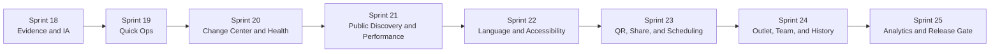

# SagaMenu UI/UX and Feature Sprint Strategy 18-25

**Tanggal:** 29 Juli 2026
**Dasar:** `sagamenu-uiux-feature-deep-research-2026-07-29.md`
**Status:** Strategi implementasi. Belum menjadi bukti staging atau production readiness.

## 1. Sasaran Program

Program Sprint 18-25 mengubah SagaMenu dari prototype editorial yang kaya fitur menjadi sistem content operations yang:

- cepat dipakai saat outlet sibuk;
- aman saat banyak perubahan menunggu publish;
- mudah dipahami oleh owner, manager, dan editor;
- cepat dipakai customer pada katalog panjang;
- siap diuji pada Laravel staging tanpa melanggar batas data Saga Platform.

Urutan ini sengaja mendahulukan workflow, safety, dan public performance sebelum growth features seperti import dan custom domain.

## 2. Cara Menjalankan

Rekomendasi timebox adalah satu minggu per sprint untuk tim kecil yang memiliki kapasitas frontend, backend, design, dan QA. Jika satu orang mengerjakan seluruh role, gunakan dua minggu per sprint tanpa mengubah urutannya.

Setiap sprint mengikuti role:

1. Product Orchestrator mengunci outcome dan boundary.
2. UX Workflow Architect membuat flow, state map, dan test task.
3. UI Visual Designer menerapkan Editorial KV Ops dan responsive states.
4. Frontend Engineer membangun interaction dan public/admin surface.
5. Backend Architect serta Database & Integration Engineer menetapkan contract, idempotency, dan tenant scope.
6. Security Engineer memeriksa permission, upload, event, dan data boundary.
7. QA & Acceptance Engineer menjalankan automated dan human acceptance.
8. DevOps & Release Engineer memvalidasi environment, observability, dan rollback.
9. Code Review & Production Auditor menutup gate.

## 3. Definition of Done Global

Sebuah sprint hanya selesai jika:

- acceptance criteria user-facing lulus;
- loading, empty, error, success, permission-denied, dan retry state tersedia;
- keyboard dan screen-reader semantics untuk critical flow diperiksa;
- desktop 1440 px, tablet landscape, serta mobile 390 px diuji;
- tenant scope dan role permission diuji pada server;
- event analytics memakai allowlist dan tidak membawa PII;
- tidak ada ordering/cart/checkout behavior;
- automated test dan human test evidence tersimpan;
- rollback atau feature flag tersedia untuk perubahan berisiko;
- dokumentasi contract, KB, dan changelog diperbarui.

## 4. Sprint 18: Evidence Baseline and Information Architecture

### Outcome

Mengunci masalah yang benar sebelum menambah fitur dan membuat baseline yang dapat dibandingkan.

### UX work

- Task map owner, manager, editor, dan customer.
- Inventory seluruh route, modal, wizard, table, preview, public state, dan dead-end.
- Lima moderated usability sessions untuk admin.
- Tiga Bio Menu dan dua Store Display customer tests.
- Card sorting ringan untuk navigation admin.
- Measure create, edit, sold-out, publish, search, dan find-item tasks.

### Engineering work

- Tambahkan test fixture 20, 100, dan 500 item.
- Instrument task events tanpa PII.
- Catat public performance baseline untuk image-heavy dan video-heavy catalog.
- Buat accessibility baseline dengan automated scan plus manual keyboard test.

### Deliverables

- Journey map dan state inventory.
- Baseline task-success/time/error.
- Ranked issue register.
- Final IA decision dan event dictionary.
- “Keep / Change / Remove” UI register.

### Exit gate

- Minimal lima admin sessions dan lima public browse sessions selesai.
- Tidak ada unresolved duplicate command pada critical flows.
- Data model/event yang dibutuhkan Sprint 19-25 disetujui.
- Boundary preview-only tertulis di acceptance plan.

## 5. Sprint 19: Quick Operations and Bulk Editing

### Outcome

Staff dapat melakukan perubahan harian tanpa membuka focused editor berulang kali.

### UI/UX

- Checkbox selection pada menu table.
- Sticky batch action bar setelah minimal satu row dipilih.
- Inline fields untuk price, category, badge, availability, dan visibility.
- Saved views: sold out, changed draft, missing media, missing alt, category.
- Mobile Shift Mode dengan search, filter, status, price, dan publish shortcut.
- Undo toast tunggal dengan affected count.

### Backend/data

- Batch mutation endpoint dengan tenant scope.
- Idempotency key per batch.
- Optimistic concurrency/version check.
- Satu audit group per batch.
- Partial failure response per item tanpa silent success.

### Tests

- Bulk change 1, 10, dan 100 item.
- Filtered select-all tidak menyentuh row di luar filter.
- Manager/editor permission matrix.
- Conflict dan retry tidak menduplikasi perubahan.
- Undo mengembalikan seluruh batch yang eligible.

### Exit gate

- Menandai 10 item sold out maksimal 45 detik pada median pilot.
- Mengubah harga 5 item maksimal 90 detik.
- Tidak ada cross-tenant mutation.
- Mobile Shift Mode tidak memiliki horizontal overflow.

## 6. Sprint 20: Draft Changes Center and Catalog Health

### Outcome

User memahami dan memperbaiki semua perubahan sebelum publish.

### UI/UX

- Command `Review changes` di global header menggantikan indikator draft yang pasif.
- Group diff: content, pricing, availability, structure, appearance, media.
- Field-level before/after.
- Filter diff per outlet, author, surface, dan severity.
- Selective discard dengan confirmation yang menyebut dampak.
- Catalog Health grouped by blocking issue dan warning.
- Attention item di dashboard membuka hasil validator yang relevan.

### Backend/data

- Canonical draft-diff service dari live snapshot ke draft state.
- Validator registry dengan stable issue code.
- Selective revert command dan audit entry.
- Health result cache yang invalidated oleh mutation terkait.

### Tests

- Diff akurat setelah create, edit, delete, reorder, appearance, media, dan batch action.
- Selective discard tidak menghapus perubahan lain.
- Blocking issue mencegah publish; warning tidak selalu memblokir.
- Safe failure menjaga snapshot live.

### Exit gate

- Semua angka “Perlu perhatian” berasal dari validator nyata.
- User dapat menjelaskan apa yang akan berubah tanpa membuka setiap item.
- Tidak ada publish ketika blocking issue belum selesai.

## 7. Sprint 21: Public Discovery and Performance

### Outcome

Customer dapat menemukan item dengan cepat pada Bio Menu dan Store Display, termasuk katalog besar.

### UI/UX

- Sticky category rail di atas menu.
- Overflow menu untuk kategori yang tidak muat.
- Search clear button, result count, zero-result recovery, dan suggested categories.
- Dietary/allergen filter sebagai informasi.
- Deep link item dan category.
- Scroll restoration saat detail ditutup.
- Tablet touch targets dan focus state yang konsisten.

### Engineering

- Responsive image variants dan `srcset`.
- Thumbnail/poster pipeline untuk video.
- Lazy loading below the fold.
- Virtualization atau windowing hanya jika hasil uji 500 item membutuhkannya.
- Cache headers dan public payload budget.
- No-autoplay enforcement.

### Tests

- 20, 100, dan 500 item.
- 5, 12, dan 30 kategori.
- Long Indonesian and English labels.
- Slow network dan Android kelas menengah.
- Deep link, back button, close detail, dan scroll restore.
- Keyboard/focus visibility.

### Exit gate

- Customer menemukan item target maksimal median 20 detik pada katalog 100 item.
- Tidak ada PDF-like pinch/zoom dependency.
- LCP, INP, dan CLS masuk budget pada environment pengujian yang disepakati.
- Video tidak autoplay dan memiliki poster.

## 8. Sprint 22: Language and Accessibility

### Outcome

SagaMenu dapat dipahami oleh audience lintas bahasa dan lebih inklusif tanpa membuat editing membingungkan.

### UI/UX

- Language switch pada public menu.
- Translation status per category/item/field.
- Missing translation dan fallback indicator di dashboard, tidak di public UI.
- Preview per locale.
- Long-text stress preview.
- Alt text editor, video caption/transcript, reduced-motion behavior.
- Contrast check untuk preset dan custom colors.

### Backend/data

- Canonical content plus translation entities per locale.
- Explicit fallback chain.
- Locale-aware slug/deep link strategy.
- Sanitized caption/transcript storage.
- Tenant-scoped translation permission.

### Tests

- Fallback tidak menampilkan key internal.
- Mixed translated/untranslated catalog.
- RTL ditetapkan sebagai future scope kecuali ada customer requirement.
- WCAG 2.2 AA critical flows.
- Custom font failure kembali ke Plus Jakarta Sans.

### Exit gate

- Public menu tetap usable ketika translation tidak lengkap.
- Critical flows lulus keyboard dan focus test.
- Contrast blocking issue muncul sebelum publish.

## 9. Sprint 23: QR, Share, and Scheduling

### Outcome

Distribusi menu menjadi objek yang dapat dikelola, diukur, dan dijadwalkan.

### UI/UX

- Share Hub menggantikan QR card tunggal.
- QR fields: name, outlet, destination surface, source/campaign, active state.
- Export PNG dan SVG.
- Logo/color customization dengan scannability warning.
- Social share preview metadata.
- Schedule item/category/promo visibility dan scheduled publish.
- Calendar and timezone status.

### Backend/data

- QR route entity yang idempotent dan tidak berubah saat desain QR diubah.
- Aggregate scan attribution.
- Schedule job dengan timezone organisasi.
- Retry, missed-job recovery, dan audit entry.
- Explicit precedence antara manual sold-out dan schedule.

### Tests

- QR destination tetap benar setelah catalog publish.
- Invalid/expired QR memiliki safe destination.
- Schedule lintas midnight dan timezone.
- Manual override conflict.
- No visitor identity pada aggregate scan report.

### Exit gate

- QR export dapat dipindai pada ukuran cetak minimum yang disepakati.
- Scheduled state jelas di dashboard dan public menu.
- Missed schedule dapat dipulihkan tanpa duplicate activation.

## 10. Sprint 24: Multi-outlet, Team, and Version History

### Outcome

Satu organization dapat mengelola beberapa outlet tanpa kehilangan scope, ownership, atau safety.

### UI/UX

- Business/outlet switcher selalu menunjukkan scope aktif.
- Action scope: outlet ini, outlet terpilih, semua outlet.
- Master catalog, duplicate catalog, dan per-outlet override.
- Conflict review sebelum propagate.
- Team screen dengan owner/manager/editor matrix.
- Pending invite, change author, approval state.
- Version timeline dengan preview, note, affected outlet/surface, dan restore.

### Backend/data

- Owner invariant dan invitation lifecycle.
- Tenant/location authorization pada semua query/mutation.
- Override precedence.
- Propagation idempotency dan conflict detection.
- Restore membuat versi baru; tidak menghapus history.

### Tests

- Cross-outlet and cross-tenant access denial.
- Last owner tidak dapat dihapus.
- Invite expiry/revoke/reaccept.
- Propagate with override conflict.
- Restore satu outlet tidak mengubah outlet lain.

### Exit gate

- User selalu dapat menyebut outlet mana yang sedang diedit.
- Approval/publish sesuai role.
- Version restore dapat dibuktikan melalui audit dan snapshot.

## 11. Sprint 25: Analytics to Action and Release Gate

### Outcome

Analytics membantu keputusan konten dan seluruh product slice siap masuk human pilot terkontrol.

### UI/UX

- Split Bio Menu dan Store Display.
- QR source breakdown.
- Detail-open rate, video play, search use, zero-result search, dan sold-out views.
- Catalog health trend.
- Data freshness dan metric definition.
- Empty/low-data states.
- Actionable operational observations tanpa klaim kausal berlebihan.

### Backend/data

- Event allowlist dan schema versioning.
- Aggregate rollup per organization/outlet/surface/day.
- Retention and deletion policy.
- Usage snapshot ke Saga Platform hanya berisi aggregate safe yang dikontrak.
- Larangan eksplisit untuk catalog content, media, raw search terms, session identifiers, dan visitor-level events.

### Release validation

- Full E2E admin and public journey.
- Accessibility regression.
- Performance and asset-budget regression.
- Security review: auth/session, tenant scope, upload, XSS, rate limit, HMAC central integration.
- Backup/restore drill.
- Queue, scheduler, email, storage, and observability checks.
- Rollback rehearsal.

### Exit gate

- Laravel staging memakai real database dan object storage yang disetujui.
- Feature flags dan rollback terdokumentasi.
- No critical/high security finding.
- Human pilot sign-off tercatat.
- Prototype fixture atau browser storage tidak dipakai sebagai production evidence.

## 12. Backlog Setelah Sprint 25

### Sprint 26 candidate: Smart Import

- CSV/XLSX import.
- Column mapping.
- Validation preview.
- Duplicate detection.
- Dry run dan rollback.
- PDF/image extraction hanya sebagai assisted draft, wajib human review.

### Sprint 27 candidate: Vertical Preset Packs

- Coffee shop.
- Restaurant.
- Bakery.
- Beauty and service catalog.
- Content-safe preset migration dan preview.

### Deferred: Custom Domain

Custom domain baru dimulai setelah tersedia:

- ownership verification;
- DNS instruction dan status;
- certificate automation;
- retry and renewal;
- safe fallback domain;
- support runbook;
- rollback.

## 13. Dependencies

| Sprint | Dependency utama |
|---|---|
| 18 | Prototype test data, participant recruitment, event policy. |
| 19 | Batch API design, audit model, role matrix. |
| 20 | Snapshot/draft model dan validator registry. |
| 21 | Media processing/storage, public caching. |
| 22 | Translation schema, accessibility content policy. |
| 23 | Scheduler/queue, QR route model, timezone source. |
| 24 | Organization/location/membership foundation. |
| 25 | Event ingestion, rollup jobs, staging infrastructure. |

## 14. Reporting per Sprint

Setiap report harus memuat:

1. Outcome yang tercapai.
2. Screen dan state yang berubah.
3. Contract/database change.
4. Automated test evidence.
5. Human test evidence.
6. Accessibility/performance result.
7. Security/privacy check.
8. Known gaps dan severity.
9. Rollback atau feature flag.
10. Status `PROTOTYPE`, `LOCAL INTEGRATED`, `STAGING`, atau `PRODUCTION`, tanpa mencampur level bukti.

## 15. Recommended First Move

Jangan langsung mengerjakan seluruh backlog visual. Mulai dari Sprint 18 selama satu minggu:

1. Freeze prototype sekarang sebagai baseline.
2. Rekrut owner/manager/staff serta customer tester.
3. Jalankan task create, edit, sold-out, publish, search, dan find-item.
4. Ukur waktu, error, hesitation, dan completion.
5. Finalkan Quick Ops wireflow dari bukti tersebut.
6. Baru implementasikan Sprint 19.

Dengan urutan ini, aset visual tambahan hanya digenerate untuk state yang benar-benar dibutuhkan oleh workflow, bukan untuk menutupi masalah informasi atau interaksi.
